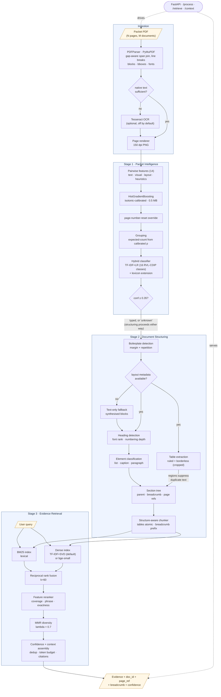
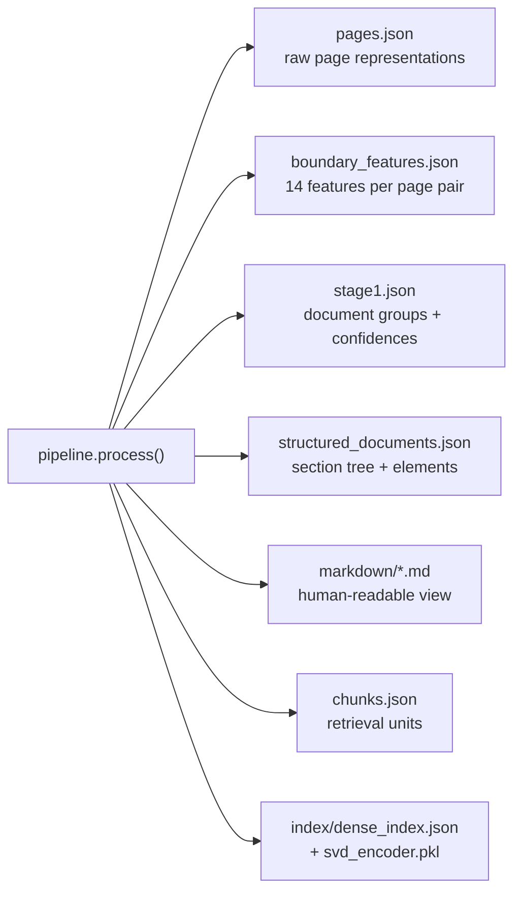

# System Architecture

## End-to-end pipeline

## Artifacts written per packet

## Model inventory

| Component | Model | Trained on | Size |
|---|---|---|---|
| Boundary classifier | HistGradientBoosting + isotonic calibration | OpenPSS SHORT, 15,906 page pairs | 0.5 MB |
| Boundary text signal | TF-IDF vectoriser | same | 2.0 MB |
| Document classifier | TF-IDF + Logistic Regression | RVL-CDIP OCR, 8,887 docs / 16 classes | 3.3 MB |
| Extension classes | Weighted lexicon (no training data available) | — | < 1 KB |
| Dense retrieval | TF-IDF + TruncatedSVD (fit per corpus) | corpus at index time | ~112 MB peak RAM |
| Dense retrieval (optional) | BAAI/bge-small-en-v1.5 | pretrained | ~130 MB |

**Total committed model footprint: 5.8 MB.** No component is trained on the DocSplit benchmark.

## Data flow contracts

| Boundary | Contract |
|---|---|
| Ingestion → Stage 1 | `list[PageRepresentation]` — text, blocks, bboxes, fonts, render path |
| Stage 1 → Stage 2 | `list[DocumentGroup]` — pages, type, confidence, source, alternatives |
| Stage 2 → Stage 3 | `list[Chunk]` — text, page_refs, breadcrumb, element_types, token_count |
| Stage 3 → caller | `list[EvidenceResult]` — evidence, doc_id, page_ref, confidence, scores |

Each stage consumes only the dataclass contract above it, so a stage can be replaced without
touching its neighbours — the dense encoder swap (hashed → SVD → transformer) exercises exactly
this property and required no change to Stage 1 or Stage 2.
